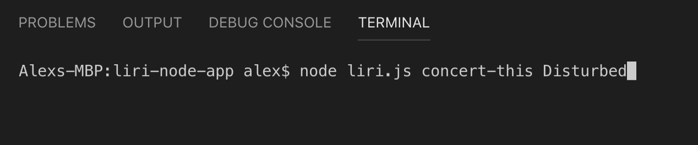
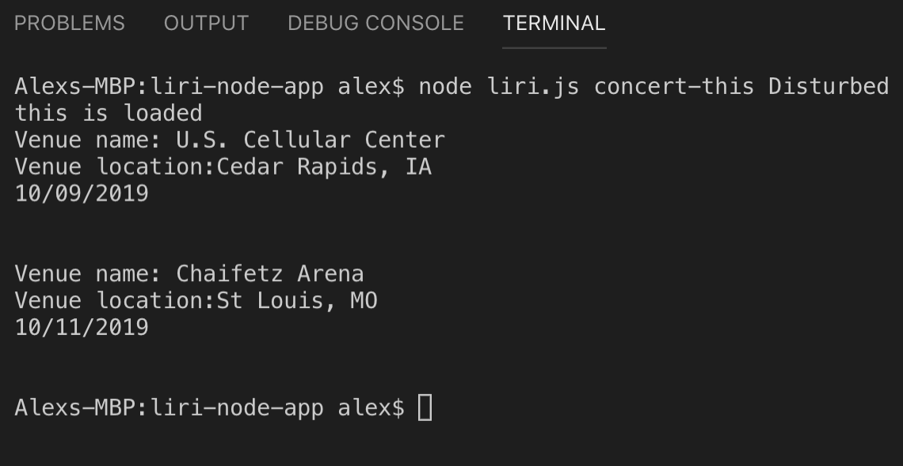

# LIRI Bot

### Purpose
The #-liri-node-app is a command line node app that takes in parameters  and return information from Spotify for songs, Bands in Town for concerts, and OMDB for movies. 

### Organization
At CLI start, call different functions via different arguments. Based on that, the appropriate API is called. 

### Overview
1. Install required npm packages (see Technologies Used).

2. Load  "node liri.js", desired action, and item of interest. 
    The possible desired actions are:
    - concert-this
    - spotify-this-song
    - movie-this
    - do-what-it-says

    Item of interest can include band, song, film title, and random.txt, respectively.
i.e. "node liri.js concert-this Disturbed"

3. Press 'Enter'

This will load the associated information.

Link to the github repository
https://github.com/farrisat/bamazon.git

### Technologies Used
The npm packages used in this app were:
    -Node-Spotify-API
    -Axios
    -Moment
    -DotEnv

The APIs used were :
    -[Node-Spotify-API](https://www.npmjs.com/package/node-spotify-api)
    -[OMDB API](http://www.omdbapi.com)
    -[Bands In Town API](http://www.artists.bandsintown.com/
    
### Role Played
Implemented code per the instructions.